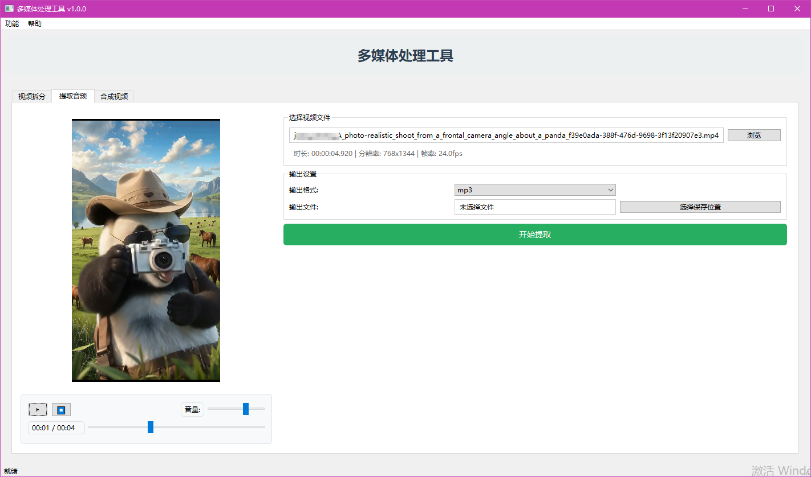
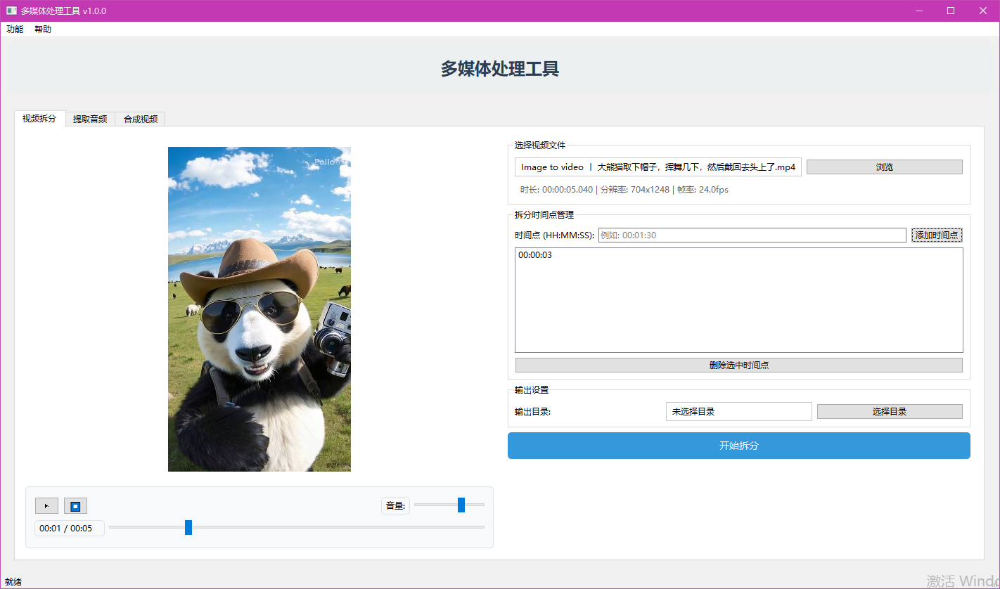
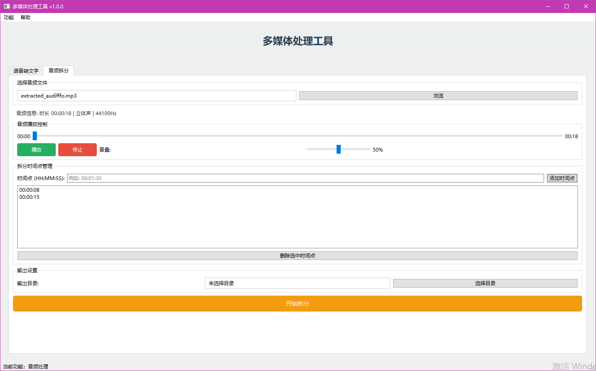
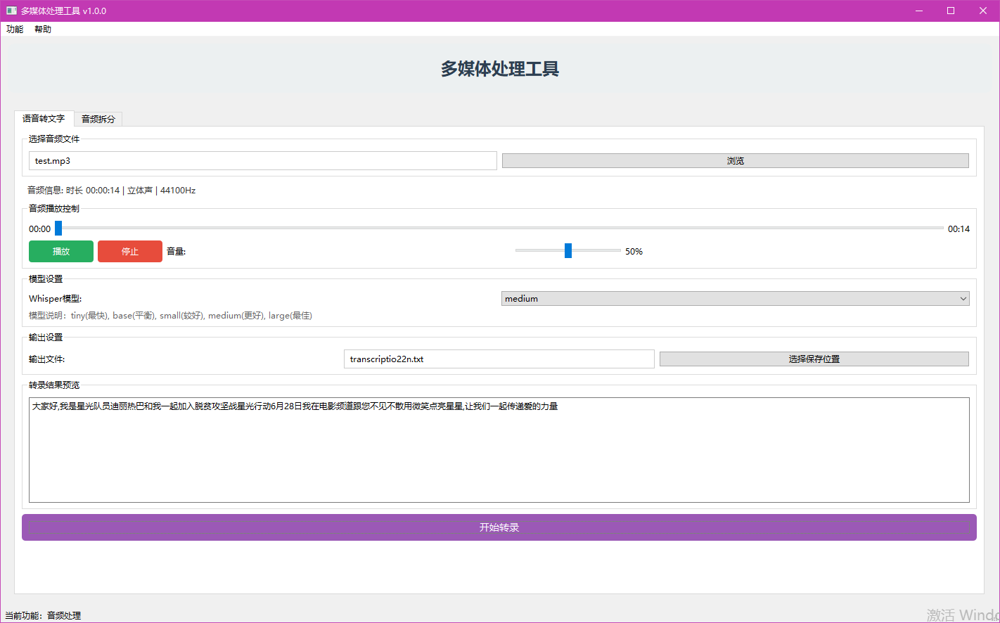
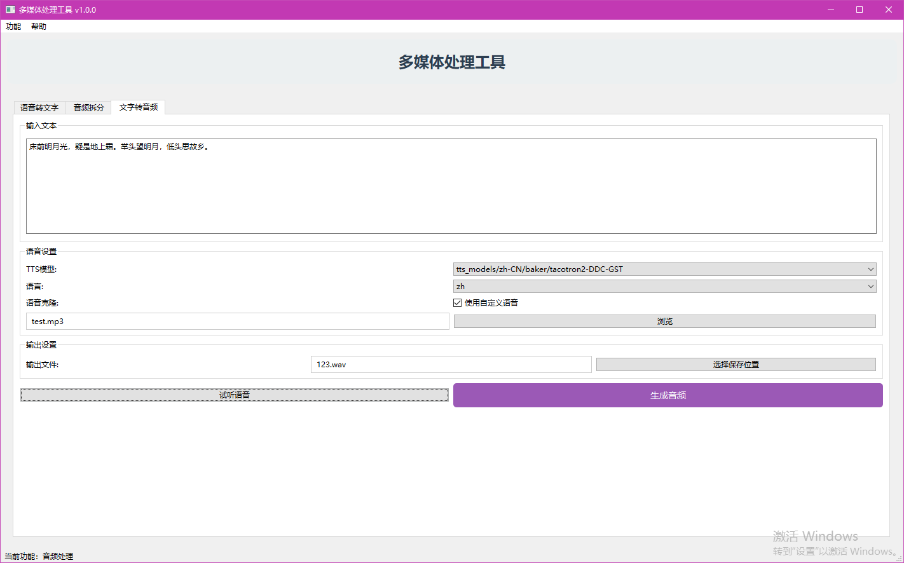
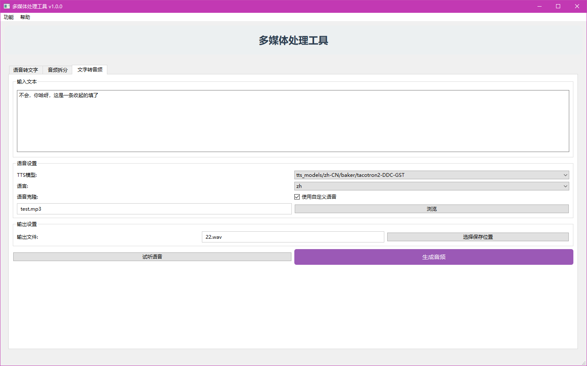

# 多媒体处理工具

一款基于Python和PySide6开发的桌面多媒体处理应用程序，提供视频和音频的处理功能。

## 🚀 快速开始

### 一键启动（推荐）
1. **选择选项**: 选择 "安装/更新依赖后启动"
2. **等待完成**: 程序会自动安装依赖并启动

### 手动启动
```bash

# 2. 启动程序
python main.py
```

## 📋 系统要求
- **Python**: 3.8 或更高版本
- **操作系统**: Windows 10/11
- **内存**: 建议 8GB+
- **网络**: 首次运行需要下载AI模型
- **下载ffmpeg,放到根目录下**: https://www.gyan.dev/ffmpeg/builds/
- **如果使用播放视频功能，Windows: 强烈建议安装 K-Lite Codec Pack (Standard) 支持多种视频类型播放**


## 🛠️ 功能特性

### 视频处理
- 视频拆分和剪辑
- 提取音频轨道
- 视频格式转换
- 视频合成和编辑

### 音频处理
- 语音转文字（基于Whisper）
- 语音转字幕（支持SRT、VTT、ASS格式）
- 音频拆分和合并
- 音频格式转换
- 文字转音频（基于Coqui TTS）效果不是特别好

---

# 开发文档

## 1. 项目概述

本项目是一款基于Python的桌面应用程序，为用户提供一个集成了视频和音频处理功能的图形化工具。软件界面注重美观与易用性，核心功能通过成熟的Python库（如`MoviePy`, `Whisper`, `Coqui TTS去除了`）实现，为用户处理日常多媒体任务提供一站式解决方案。

## 2. 技术选型

### 2.1 GUI框架

为了满足“美观”和“现代感”的需求，推荐以下框架：

*   **首选：`PySide6` 或 `PyQt6`**
    *   **优点**：功能极其强大，社区成熟，可通过QSS（Qt Style Sheets，类似于CSS）实现高度自定义的界面美化，能够打造出专业级的桌面应用。

### 2.2 核心库

*   **视频处理**: `moviepy`
*   **语音转文字**: `openai-whisper`
*   **音频格式处理**: `pydub`
*   **文字转语音**: `TTS` (Coqui TTS)已经去除
*   **深度学习后端**: `torch` (Whisper和Coqui TTS的依赖)已经安装了
*   **底层多媒体处理**: **FFmpeg.exe** (必须预先安装并配置好环境变量)已经下载了：https://www.gyan.dev/ffmpeg/builds/

### 2.3 注意

*   **Coqui TTS**: 在安装 pip install TTS 时，如果本地没有Visual Studio 生成工具。额外的处理方法是直接下载whl进行安装(绕过编译)：
```
mkdir tts_build
cd tts_build
pip wheel TTS

pip install --no-index --find-links=. TTS

```


## 3. 功能需求规格 (FRS)

### 3.1 主界面与菜单

*   **主窗口**：拥有清晰的布局，顶部设有菜单栏。
*   **菜单栏**：包含两个主菜单项：“**视频处理**”和“**音频处理**”。点击每个菜单项会切换到对应的功能区（建议使用Tab页或堆叠窗口 `QStackedWidget` 实现）。

---

### 3.2 视频处理模块

#### 功能 (1): 视频拆分

*   **功能描述**: 用户可以上传一个视频文件，并通过设置多个时间点，将视频精确地拆分为N+1个片段。
*   **输入**:
    *   一个视频文件路径 (`.mp4`, `.mov`等)。
    *   一个或多个拆分时间点列表 (格式 `HH:MM:SS` 或总秒数)。
*   **输出**:
    *   多个按顺序命名的小视频文件（如 `output_part_1.mp4`, `output_part_2.mp4`...）。
*   **核心实现逻辑**:
    1.  使用`moviepy.VideoFileClip`加载视频。
    2.  获取视频总时长，确保拆分点有效。
    3.  根据拆分点列表，循环使用`subclip(start_time, end_time)`方法截取片段。
    4.  使用`write_videofile()`保存每个片段。
*   **UI/UX建议**:
    *   提供一个“添加时间点”按钮和一个列表框，用于显示和管理所有拆分点。
    *   （进阶）可以集成一个带有预览和时间轴的视频播放器，允许用户在时间轴上直接点击标记拆分点。

#### 功能 (2): 提取音频

*   **功能描述**: 从视频文件中分离出完整的音轨，并保存为独立的音频文件。
*   **输入**:
    *   一个视频文件路径。
*   **输出**:
    *   一个音频文件 (`.mp3` 或 `.wav`)。
*   **核心实现逻辑**:
    1.  加载视频 `video = VideoFileClip("path/to/video.mp4")`。
    2.  提取音轨 `audio = video.audio`。
    3.  保存音频 `audio.write_audiofile("output_audio.mp3")`。
*   **UI/UX建议**:
    *   一个“上传视频”按钮和一个“开始提取”按钮。
    *   允许用户选择输出的音频格式（如MP3, WAV）。

#### 功能 (3): 合成视频与音频

*   **功能描述**: 将一个视频文件和一个音频文件合并，生成一个新的视频。
*   **输入**:
    *   一个视频文件路径 (作为画面源)。
    *   一个音频文件路径 (作为声音源)。
    *   一个布尔选项：“**静音原视频音轨**”。
*   **输出**:
    *   一个合成后的新视频文件。
*   **核心实现逻辑**:
    1.  加载视频 `video_clip = VideoFileClip(...)`。
    2.  加载音频 `audio_clip = AudioFileClip(...)`。
    3.  根据“静音”选项，决定是否保留原音。通常直接替换。
    4.  使用 `new_video = video_clip.set_audio(audio_clip)` 将新音频设置到视频上。
    5.  保存新视频 `new_video.write_videofile(...)`。
*   **UI/UX建议**:
    *   两个“上传”按钮，分别用于视频和音频。
    *   一个清晰的复选框（`QCheckBox`）：“**替换视频原有声音**”（默认勾选）。

---

### 3.3 音频处理模块

#### 功能 (1): 语音转文字 (字幕提取)

*   **功能描述**: 将音频文件中的语音内容识别并转换为纯文本，保存为`.txt`文件。
*   **输入**:
    *   一个音频文件路径 (`.mp3`, `.wav`等)。
*   **输出**:
    *   一个`.txt`文件，包含识别出的所有文字。
*   **核心实现逻辑**:
    1.  使用`pydub`将上传的音频统一转换为`WAV`格式，以获得最佳兼容性。
    2.  加载`faster-whisper`模型 `model = WhisperModel(model_size, compute_type="float32")`。
    3.  调用 `segments, info = model.transcribe("path/to/audio.wav", language="zh")`。
    4.  将转录文本写入文本文件。
*   **UI/UX建议**:
    *   一个"上传音频"按钮。
    *   一个下拉框，允许用户选择Whisper模型的大小（如`tiny`, `base`, `small`），并提示不同模型的速度和精度差异。
    *   一个进度条，因为大文件的处理时间可能较长。

#### 功能 (1.5): 语音转字幕

*   **功能描述**: 将音频文件中的语音内容识别并转换为带时间戳的字幕文件，支持多种字幕格式。
*   **输入**:
    *   一个音频文件路径 (`.mp3`, `.wav`等)。
    *   字幕格式选择 (`SRT`, `VTT`, `ASS`)。
*   **输出**:
    *   一个字幕文件，包含时间戳和对应的文字内容。
*   **核心实现逻辑**:
    1.  使用`faster-whisper`进行语音识别，保留时间戳信息。
    2.  根据选择的格式生成相应的字幕文件：
        *   **SRT格式**: 标准字幕格式，时间戳格式为 `HH:MM:SS,mmm`
        *   **VTT格式**: Web视频字幕格式，时间戳格式为 `HH:MM:SS.mmm`
        *   **ASS格式**: 高级字幕格式，支持样式设置
    3.  自动进行繁体转简体转换（如果安装了opencc）。
*   **UI/UX建议**:
    *   在语音转文字界面添加字幕格式选择选项。
    *   提供"生成字幕"按钮，与"生成文本"按钮并列。
    *   字幕预览区域，显示生成的字幕内容。

#### 功能 (2): 音频拆分

*   **功能描述**: 与视频拆分逻辑相同，但处理对象为音频文件。
*   **输入**:
    *   一个音频文件路径。
    *   一个或多个拆分时间点列表。
*   **输出**:
    *   多个按顺序命名的小音频文件。
*   **核心实现逻辑**:
    1.  使用`pydub.AudioSegment.from_file()`加载音频。
    2.  时间单位为毫秒。根据拆分点列表，循环切片音频。
    3.  使用 `segment.export()` 保存每个片段。
*   **UI/UX建议**:
    *   与视频拆分界面类似，提供时间点管理功能。

#### 功能 (3): 文字转语音 (TTS)

*   **功能描述**: 将用户输入的文本转换为语音，并提供使用内置声音或克隆用户声音的选项。
*   **输入**:
    *   一个多行文本输入框中的文字。
    *   **模式选择**: 内置声音 vs. 克隆声音。
    *   如果选择**内置声音**: 从下拉列表中选择一个声音。
    *   如果选择**克隆声音**: 上传一个3-15秒的参考音频文件。
*   **输出**:
    *   一个生成的`.wav`音频文件。
*   **核心实现逻辑**:
    1.  初始化`TTS`模型 `tts = TTS("path/to/your/tts_models/...")`。
    2.  **获取内置声音列表**: `speaker_list = tts.speakers`，填充到UI的下拉列表中。
    3.  **判断模式**:
        *   如果用户选择了“克隆声音”并上传了文件，则调用 `tts.tts_to_file(..., speaker_wav="path/to/uploaded.wav", ...)`。
        *   否则，使用“内置声音”模式，调用 `tts.tts_to_file(..., speaker="selected_speaker_name", ...)`。
*   **UI/UX建议**:
    *   使用单选按钮（`QRadioButton`）来切换“使用内置声音”和“使用我的声音”两种模式。
    *   **内置声音模式下**:
        *   一个下拉列表（`QComboBox`）展示所有内置声音。
        *   旁边提供一个“**试听**”按钮，可以快速生成一小段固定文本（如“你好”）的音频并播放，帮助用户选择。
    *   **我的声音模式下**:
        *   一个“上传参考音频”按钮和一个标签，用于显示已上传的文件名。
    *   一个大的文本框（`QTextEdit`）用于输入要转换的文字。
    *   一个“开始生成”按钮和一个进度提示。

## 4. 环境搭建与依赖

1.  **创建虚拟环境**:
    ```bash
    python -m venv venv
    .\venv\Scripts\activate  # Windows
    ```
2.  **安装所有依赖**:
    ```bash
    pip install moviepy openai-whisper pydub torch torchaudio --index-url https://download.pytorch.org/whl/cu118
    pip install TTS
    pip install PySide6  # 或者 PyQt6, CustomTkinter
    ```
    **注意**:
    *   请确保安装与您的CUDA版本匹配的`torch`。如果您的电脑没有NVIDIA GPU，请安装CPU版本的torch。
    *   **FFmpeg必须单独安装**并将其可执行文件路径添加到系统环境变量中。

## 5. 开发路线图建议

1.  **后端功能实现**: 先不考虑GUI，为每个功能编写独立的Python脚本，并进行充分测试，确保核心逻辑无误。
2.  **GUI框架搭建**: 使用所选的GUI框架，搭建出主窗口、菜单栏和各个功能标签页的基本布局。
3.  **功能逐一集成**: 将后端脚本的功能逐个封装成函数或类，并与GUI控件的事件（如按钮点击）进行绑定。从最简单的“提取音频”功能开始。
4.  **处理长耗时任务**: 对于Whisper转录、TTS生成和视频写入等耗时操作，**必须使用多线程**（如PyQt/PySide的`QThread`），以防止GUI界面冻结。在线程中执行任务，并通过信号与槽机制将进度和结果更新回主界面。
5.  **美化与优化**: 在功能全部实现后，使用QSS或主题对界面进行美化，优化用户体验，增加错误处理和提示信息。


---

### UI











